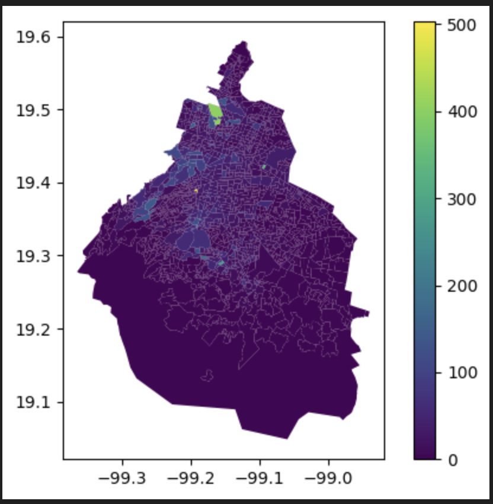

# Desafío Agua CDMX: Análisis y Visualización de Consumo


## 📖 Descripción

Este es un proyecto de **Análisis y Visualización de Datos** que explora los patrones de consumo de agua en la Ciudad de México. La solución se presenta como una **aplicación web interactiva** construida con **Streamlit**, diseñada para identificar "hotspots" (puntos calientes) de consumo, analizar tendencias temporales y visualizar desigualdades en el acceso al agua a nivel de colonia y alcaldía.

El objetivo es transformar datos públicos en insights accesibles que ayuden a entender mejor la compleja dinámica del agua en una de las ciudades más grandes del mundo.

## 🚀 App en Acción

¡Así se ve la aplicación interactiva funcionando! Primero, el mapa principal de consumo y luego la primera pantalla de la app en streamlit.


_Mapa coroplético interactivo que muestra el consumo de agua por colonia._


_Página principal de la app._

## ✨ Características Clave

*   **Análisis Exploratorio Interactivo:** Filtra y explora los datos por alcaldía, año y tipo de usuario directamente desde la interfaz.
*   **Visualizaciones Geoespaciales:** Mapas coropléticos para identificar patrones geográficos y hotspots de consumo de manera intuitiva.
*   **App Multi-página:** Navegación clara y organizada gracias a la estructura multi-página de Streamlit, con secciones dedicadas a mapas e insights.
*   **Notebook Reproducible:** Incluye un notebook de Jupyter con todo el proceso de limpieza y análisis para total transparencia y reproducibilidad.

## 🛠️ Tecnologías Usadas

<p align="left">
  <a href="https://www.python.org" target="_blank">  </a>
  <a href="https://streamlit.io/" target="_blank">  </a>
  <a href="https://pandas.pydata.org/" target="_blank">  </a>
  <a href="https://numpy.org/" target="_blank">  </a>
  <a href="https://jupyter.org/" target="_blank">  </a>
  <a href="https://git-scm.com/" target="_blank">  </a>
</p>

## ⚙️ Instalación y Uso

Sigue estos pasos para ejecutar la aplicación en tu máquina local.

1.  **Clona el repositorio:**
    ```
    git clone https://github.com/TuUsuario/desafio-agua-cdmx.git
    cd desafio-agua-cdmx
    ```
2.  **(Opcional pero recomendado) Crea y activa un entorno virtual:**
    ```
    # Crea el entorno
    python -m venv venv
    # Actívalo
    source venv/bin/activate  # En Windows: venv\Scripts\activate
    ```
3.  **Instala las dependencias:**
    ```
    pip install -r requirements.txt
    ```
4.  **Ejecuta la aplicación de Streamlit:**
    ```
    streamlit run Main_Page.py
    ```
Una vez iniciada, la aplicación estará disponible en tu navegador, usualmente en `http://localhost:8501`.

## 📂 Estructura del Repositorio

| Carpeta/Archivo      | Descripción                                                                  |
|----------------------|------------------------------------------------------------------------------|
| `Main_Page.py`       | Script principal para iniciar la aplicación Streamlit.                       |
| `pages/`             | Contiene las sub-páginas de la aplicación (mapas, gráficas, etc.).           |
| `data/`              | Almacena los datasets procesados y crudos utilizados en el análisis.         |
| `notebooks/`         | Contiene el Jupyter Notebook con el análisis exploratorio y espacial.        |
| `docs/`              | Imágenes de la aplicación.                                                   |
| `README.md`          | ¡Estás aquí!                                                                 |

## 🤝 Contribuciones y Licencia

Este proyecto está protegido bajo la **Licencia MIT**. Las contribuciones son más que bienvenidas. Si tienes una idea para mejorar el análisis, agregar una nueva visualización o corregir un error, por favor abre un *issue* para discutirlo o envía directamente un *pull request*.

## 👤 Autor

¡Conéctame para hablar de datos, desarrollo y cómo la tecnología puede generar impacto social!

*   **GitHub:** [LuisT0](https://github.com/LuisT0)
*   **LinkedIn:** [Luis Antonio Torres Villalobos](https://www.linkedin.com/in/luis-antonio-torres-villalobos/)

